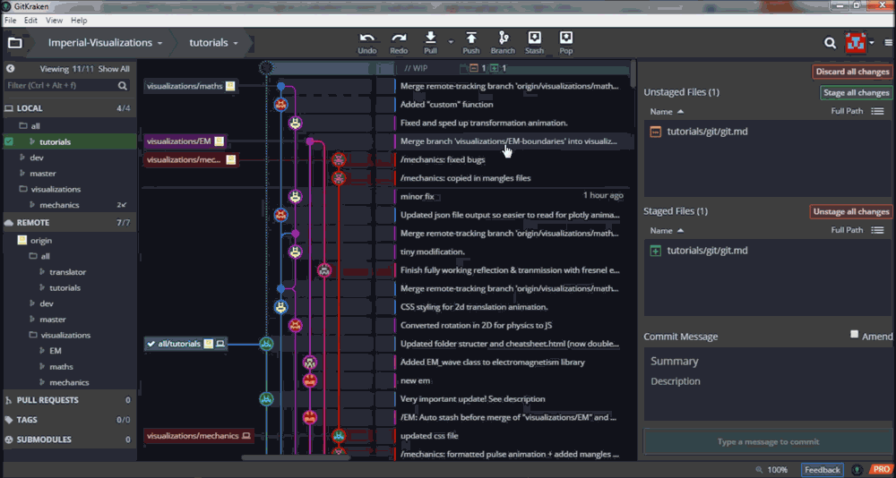

# Git Tutorial (2017)

*This is a basic tutorial to using git for file history and version control in this project. If you really want to make the most of this powerful tool I recommend reading and working through the "Pro Git" book by Scott Chacon and Ben Straub, particularly chapters 1, 2, and 3. It is available online at https://git-scm.com/book/en/v2.*

In this tutorial the % sign is used to signify a placeholder. For example %username% would mean to use the relevant name.

## Introduction

Git is a version control system (VCS) used for tracking and coordinating changes in computer files, and is particularly useful for work involving multiple people. For this Imperial Visualizations project we will be using GitHub - a web based version control repository (repo) and internet hosting service. 

## Getting Started

1. Create a GitHub account https://github.com/. You can also use your student email address to activate the Student Develop Pack https://education.github.com/pack which comes with a multitude of software development tools and perks such as private repos (lasts a limited time).

2. Contact Caroline Clewley with your GitHub username/email to be added to the Imperial-Visualizations repo.

3. The owner of the repo can add collaborators by going to Repositories -> Imperial-Visualizations -> Settings -> Collaborators -> (scroll to bottom) Search by username, full name, or email address.

4. Work through the GitHub "Hello World" guide available at https://guides.github.com/activities/hello-world/ to get to grips with the basic concepts. 

5. Have a look at the other guides are available at https://guides.github.com/ (non-essential).  

## GitKraken

GitKraken is a GUI (Graphic User Interface) git client that greatly speeds up the process of starting to using git for project collaboration. It is recommended that unless you have used git before you do not use the CLI (Command Line Interface) as this will require substantial effort in self-learning and if used incorrectly may cause issues within the repo. For this project we are currently using GitKraken non-commerically.

1. Download GitKraken https://www.gitkraken.com/ and log in with your GitHub account.

2. Clone the Imperial-Visualizations repo by going to File -> Clone Repo -> Clone -> GitHub.com -> %owner username%/Imperial-Visualizations. Select a folder to clone to and press "Clone the repo!" (in this example I used a "UROP/Imperial Visualizations" folder which now contains a "GitHub-Tutorial" folder - the repo.)

   -clone--

3. You are now ready to use GitKraken to contribute to the Imperial-Visualizations repo. Although you can simply read the rest of the tutorial, it is recommended to create a test repo and repeat the step 2 (above) for this new repo before continuing. You should first use this test repo to make sure that you understand the git features below. 

   --create test repo-- 

## The Basics 

This is the most important part of the whole tutorial. The content covered above is fairly straightforwards, but it is essential that you understand this section in order to make sure that your time spent using git to work collaboratively on this project goes as smoothly as possible.

### Committing, Pushing, and Pulling 

Now that you have access to the repo you can make changes.

1. Any changes made within the local repo folder will be recognised by GitKraken. Changes will in appear the top row of GitKraken as //WIP (Work in Progress) and file changes will be defined as green (added), yellow (edited), red (deleted), or blue (moved). In this example a file has been added.

   --folder changes--

2. **Committing**
Now that changes have been made we can now commit (save) the change as part of the project workflow. First select the files you want to commit the changes to and stage them (or use "Stage all changes" to do this for all files). In this example there are no changes to discard (careful since this reverts all changes since the last commit!), but this can be done by right clicking on files individually or by clicking "Discard all changes" to do this for all files. 

   --staging file and committing (highlight discard options)--
   
>Note: Clicking on a file before staging also tells you what changes have been made since the last commit.

   Now add a useful commit message and description so that others can see what changes have been made. The change can then be committed, which will appear as a new node in the directed acrylic graph (DAG).
   
   --adding commit message and pushing--
   
   Using commits means that our work at that stage is saved as part of the project workflow. This allows us to revert back to that repo (and hence file) state if anything goes wrong. To do this right click on the node, go to "reset %branch% to this commit" and choose how strongly to revert changes. In this case we are working on the master branch (more on branches later). 
   
   --revert changes to a commit--
   
3. **Pushing**

   Although the changes have been committed they have not yet been pushed online, so other collaborators accessing the repo cannot see them. This is the difference between local and remote files (covered in the next section) and in order for other collaborators to see our changes we must first "Push" them. 

   --pushing--

   You can also perform multiple commits before pushing. This is especially useful for squashing fairly insignificant commits together or even completely resetting commits themselves, neither of which can be done once the commits are pushed online.
   
   --renaming a file twice (2 commits) then squashing before pushing--
   --reverting a commit--

4. **Pulling**

   If another collaborator pushes changes they will appear as remote changes. In this example imagine the changes made on the GitHub website represent those made by another collaborator. In order to apply these changes to our local files we must first "Pull" them to our local files. 

   --make and pulls some changes--
   
   If both collaborators work at the same time and collaborator 1 pushes commits while collaborator 2 is still at work, git recognises that the local files of collaborator 2 are no longer in sync with the remote files. If collaborator 2 then attempts to push some commits, GitHub automatically merges the remote and local files before applying the changes. 
   
   --merge remote--
   
   This can look quite ugly on the DAG, so it is important to solve this by pulling before making any commits. This ensures that local and remote files are synced and GitKraken automatically stashes and pops any WIP to avoid losing work (more on stashing and popping later).

   --fix merge remote & auto stash and pop--
   
>Life Pro Tip: Pull before you Commit, Commit before you Push.

### Local and Remote Files

We discussed these a lot in the previous section but what exactly is the difference?

1. **Local Files** 

   Local files are a copy of the GitHub repo on your computer, and any changes made within this folder are recognised by git. Only you can see the changes made here until they've been committed and pushed.

2. **Remote Files** 

   Remote files are online in the GitHub repo and any pushed commits will affect these files. This is the repo that everyone is working together on and changes made by other collaborators are pulled to local from here. 
   
## Other Key Features

This part covers the rest of the features that you will need to understand what exactly is going on when you use git throughout this project.

### Branches

Branches are a very powerful tool for software development but can be quite tricky to get to grips with. Here we will cover the basics but anyone to looking gain a better understanding should refer to chapter 3 of the "Pro Git" book mentioned at the start of this tutorial.

1. **Starting a Branch**  

   A branch can be started from any commit by right clicking and selecting "Create branch here". After naming the branch (ideally with its purpose or following a defined branch naming convention) this copies the repo state at that commit to a new branch. You must first push a locally created branch to have it appear in the remote repo.

   -- starting branch--

2. **Why Branches?**

   Branches are generally created in order to focus on or solve a particular issue. Pulling, committing, and pushing is separate for each individual branch, so all commits in a branch should be related to its singular purpose. This avoids people pulling or seeing changes that are unrelated to their current goal. Also if it turns out that e.g. a particular feature isn't possible we can simply discontinue that branch, keeping the main development branch clean and focused.

>Note: This also allows for commits to be cleaned up (e.g. squashed) before rebasing or merging to the main development branch (more on merging and workflows later).

   --separate commits--

3. **Branch Navigation**

   To create branches under an overarching subgroup, folders can be created by naming the branch using "%subgroup%/%purpose%" e.g.  "fix/particle_physics" would create a "particle_physics" branch under a "fix" folder. All branches in the repo are shown in GitKraken under "REMOTE" on the lefthand toolbar. To pull a branch to your computer double click on it and it should now also appear under "LOCAL". 
   
   --local/remote and folders--
   
   In order to stay on task you should ideally only pull branches that you're working on to your "LOCAL". For each branch GitKraken will automatically tell you if you're behind remote (have commits to pull) or ahead (have commits to push). In the example above, the local "fix/particle_physics" branch is 1 commit ahead of remote whilst "bugs/plotly" is 3 commits behind. GitKraken also shows the position of the local and remote branches on the DAG, with the repo owner's GitHub avatar for remote and a computer icon for the local branch.

4. **Switching Branches**

   To switch between branches simply double click on the local branch that you want to access. This will change the local files to reflect the content in that branch. 
   
   --double click --

### Stashing and Popping

Stashing and Popping can be used to store work for later without committing, but is most useful for switching between branches. 

1. **Stashing WIP to Switch Branches**

   If you have WIP and attempt to change branches, you will receive an error message saying "Checkout Failed". This is because we need to first commit any WIP but if the work isn't useful enough to commit yet then we can "Stash" it for later.

   --attempt to switch, then stash and switch--

2. **Popping a Stash**

   Stashes appear as a dotted square node on the DAG. Upon returning to the branch with the stashed work we can "Pop" the stash to retrieve our WIP.

   --return to branch, pop stash and show work returning to WIP--

3. **Stash Navigation**

   Any stashes will also appear on the left under "STASH".

   --show stash list--

### Merging and Pull Requests

After completing work in a branch we need to merge it back to the main development branch. This ensures that the overall project workflow is in a single place, in this case a branch. For example, currently when a subgroup completes a visualization it is merged to the dev (development) branch. To avoid losing any work only someone who is comfortable with how git works should merge branches (and ideally by pull request - see below section on Workflow). 

1. **Merging Branches**

   To merge a branch to another branch, first work in the branch that you want to merge to (e.g. dev) and right click on the branch you want to merge to it. Then simply click on "Merge %branch% to into %branch%" and commit the change. 

   --right click and merge--

2. **Resolving Merge Conflicts**

   Merge conflicts will arise if a file has been changed both in the branch being merged and in the branch being merged to. GitKraken has a very useful tool which allows us to see and resolve these conflicts. Simply click on the conflicted file and a view of the file in both branches will be opened. Conflicted code will be highlighted so simply tick the code that you want to keep (you can even keep the code from both branches) then click on the "Save and mark resolved" button when done. You can now commit the change.
   
   --mark some as resolved and save and commit--

3. **Pull Requests** 

   It is also possible to merge via a pull request Here when right clicking we use "Push %branch% and start a pull request to %branch%" instead of simply merging. This starts a pull request online where everyone collaborating on the repo can view the commits that have been made to the branch being merged. They can then review and comment on the commits to suggest their thoughts or possible changes, ensuring that everyone agrees that the commits should be applied before a merge is completed. 
   
   --show and pull request--
   
   Pull requests encourage discussion driven development in which everyone can see and understand the changes being made. This helps the team to be on the same page throughout the project.

### Workflows

1. **Current Workflow**

   Our current workflow uses "Long-Running Branches". We currently have master (merge completed work for release) and dev (merge "finished" work for testing and feedback) branches as the long running branches. The master branch should only be merged to from dev. Sub-branches include translator and tutorial branches under the "all" subgroup as anyone can contribute to these, and EM (electromagnetism), maths, and mechanics branches under the "visualizations" subgroup. These are the three visualization development streams for the 2017 project. 

>Note: It is recommended to use pull requests for all merging. Currently the dev and master branches are protected to only be merged by pull request.

   --“silo” view of progressive-stability branching from the "Pro Git" book. Available at https://git-scm.com/book/en/v2/Git-Branching-Branching-Workflows (2017)--

   The image above shows a "silo" view of a commonly used project workflow known as "Progressive-Stability Branching". This year we used a variation of this since not everyone was fully comfortable with git. Our main work "silos" were just the three long-running visualization subgroup branches with an overall (not singular) purpose. Also, there were no visualizations yet created at this point, so discussion and file sharing between the overall group and particularly within subgroups was very important. Files where everyone should use the same copy of the file were pushed onto the "all/tutorials" branch where e.g. this tutorial and the css stylesheet were worked on. The "all/translator" branch was for a Python-Javascript plotly translator project undertaken this year.

   --image of our current structure--

2. **Other Possible Workflows**

   If everyone is comfortable with git it may be better to remove the main visualization subgroup branches and have everyone create "Topic" branches straight from dev to focus on their individual purpose. Since tutorials and the translator should hopefully be completed this year, there would only be main two long-running branches - master (again merge completed work for release) and dev (merge completed topic branches). This would create a cleaner workflow and makes file sharing easier (all files readily available to everyone on dev), but does require absolutely every team member to be confident with branches. Branches would be deleted once merged since they would no longer be needed (no need to worry - commits are saved in the git history). 

   Another idea may be to fork the Imperial-Visualizations repo to a new repo for each subgroup and then merge any completed work back to the dev branch in the main repo via pull request. This has a similar structure to the previous suggestion but without the repo showing a multitude of different branches which are unrelated to each subgroup's individual work. Since this year the entire team is encountering similar obstacles and thus working closely together it currently makes sense to keep all work in a single repo to instantly share any progress.
   
>Note: If using these workflows it is reommended to keep the dev and master branches protected to only be merged by pull request.

## Further Reading

You've now reached the end of this tutorial, which has hopefully covered all the core features of git that you will need for this project. As mentioned at the very beginning, if you want to know more about anything covered in this tutorial or just more about git in general, the "Pro Git" book by Scott Chacon and Ben Straub is available at https://git-scm.com/book/en/v2. It is a fantastic resource and I highly recommend having a look if time allows.

_________________________________________________________________________________________________

Thanks for reading this far! Please direct any further questions, suggestions, or corrections to Anthony Li (@anthony_li) on the Imperial-Visualizations Slack.
